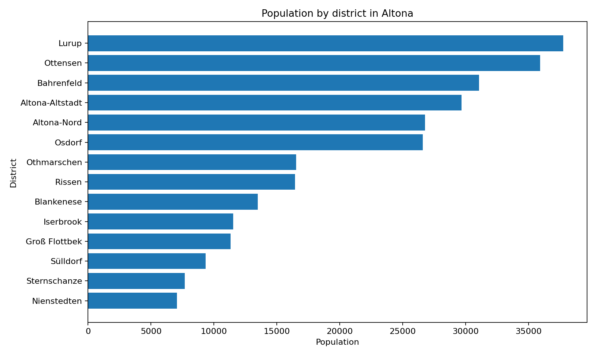
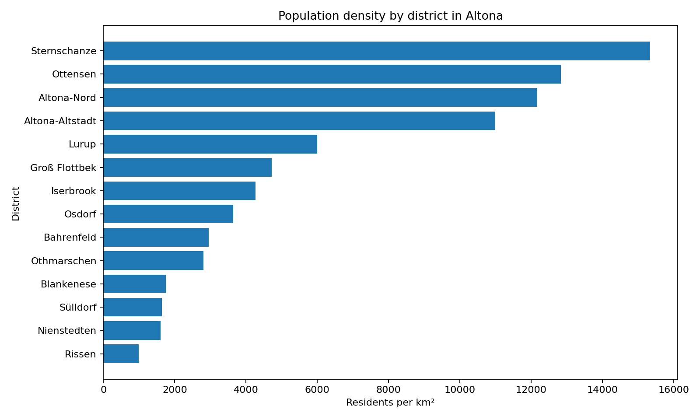
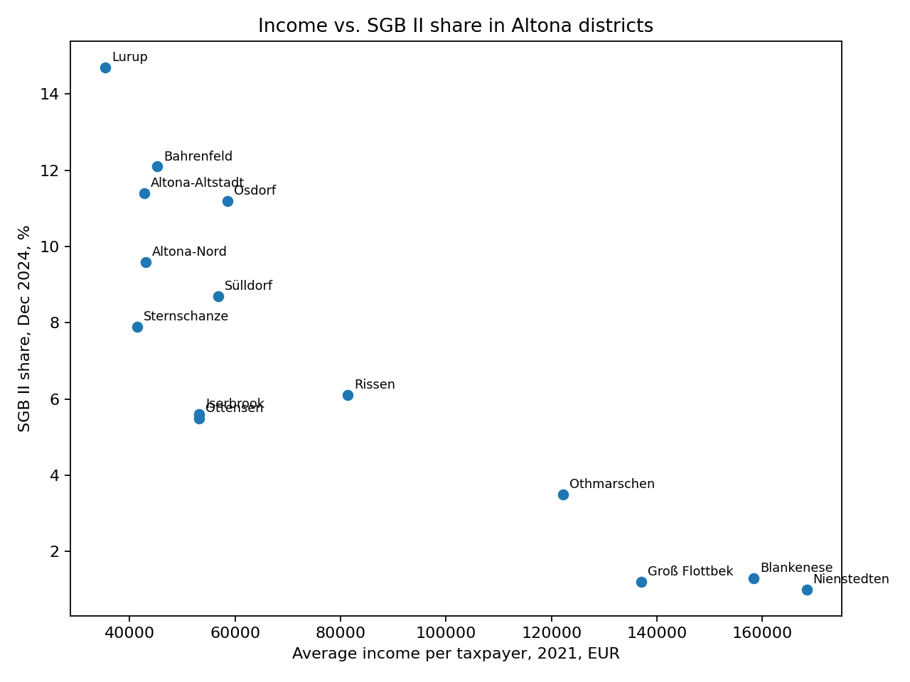
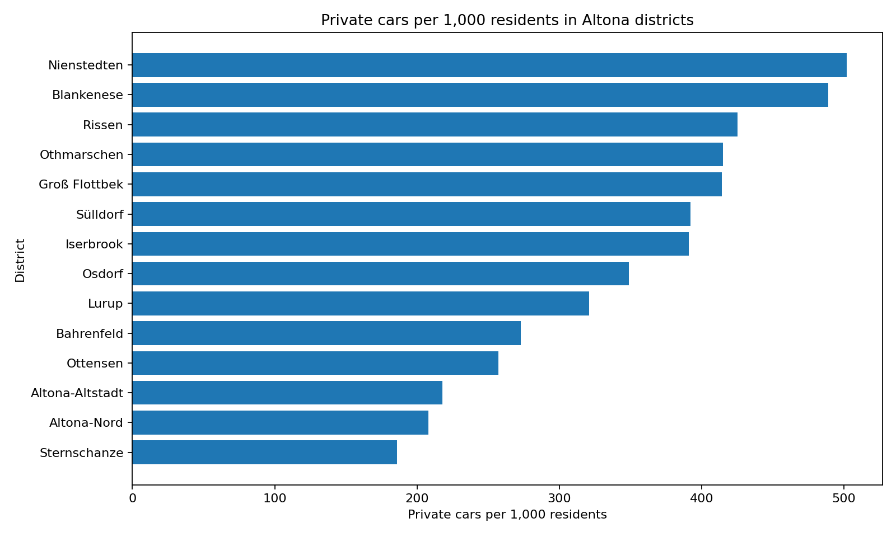

# Hamburg District Data Basics

**Public Hamburg district data · Altona case study · Python/pandas · dataset contract · automated tests · descriptive analysis · Power BI design**

[](https://github.com/DataTideHH/hamburg-district-data-basics/actions/workflows/ci.yml)

This repository demonstrates a documented workflow from an official public source through **data lineage, automated validation, reproducible analysis and recruiter-reviewable reporting artifacts**.

The current scope is deliberately limited to the **14 districts in the borough of Altona, Hamburg**. The small scope keeps the dataset contract, transformations, analytical logic and limitations transparent before any later expansion.

---

## Results at a Glance

The canonical metrics are generated by the analysis workflow and committed as [`reports/generated/summary_metrics.json`](reports/generated/summary_metrics.json).

| Indicator | Descriptive result |
|---|---|
| Districts | **14** |
| Total population | **281,136** |
| Total area | **77.8 km²** |
| Aggregate population density | **3,614 residents/km²** (`total population / total area`) |
| Largest population | **Lurup** — 37,755 residents |
| Highest district density | **Sternschanze** — 15,338 residents/km² |
| Highest average income per taxpayer | **Nienstedten** — €168,404 (2021) |
| Highest unemployment share | **Lurup** — 8.5% (December 2024) |
| Highest SGB II share | **Lurup** — 14.7% (December 2024) |
| Highest private-car rate | **Nienstedten** — 502 per 1,000 residents (January 2025) |

Within this small dataset, average income per taxpayer is negatively correlated with SGB II share (**-0.86**) and unemployment share (**-0.91**). These are descriptive Pearson correlations across 14 districts and do not establish causality.

The complete interpretation is available in [`reports/findings.md`](reports/findings.md).

### Selected Analysis Outputs

<table>
<tr>
<td width="50%">

</td>
<td width="50%">

</td>
</tr>
<tr>
<td width="50%">

</td>
<td width="50%">

</td>
</tr>
</table>

The visual titles and surrounding documentation state the actual reporting periods. Existing figure paths remain stable for links already used in the portfolio.

---

## Analytical Questions

The workflow supports descriptive questions such as:

- Which Altona districts differ most strongly by population size and density?
- How do district-level income, unemployment and SGB II indicators differ?
- Which districts show unusually high or low private-car ownership?
- Which metrics can be aggregated safely, and which require their original denominators?
- Which source dates and interpretation limits must remain visible in a BI report?

The purpose is not to produce a complete urban-policy study. It is to demonstrate a transparent path from source data to validated analytical outputs and aggregation-aware BI design.

---

## Data Source, Grain and Lineage

| Item | Value |
|---|---|
| Source | [Hamburger Stadtteil-Profile 2024](https://www.statistik-nord.de/fileadmin/user_upload/Stadtteil-Profile-HH_BJ-2024.pdf) |
| Publisher | Statistikamt Nord |
| Geographic grain | One row per Hamburg district / Stadtteil |
| Current scope | 14 districts in the borough of Altona |
| Source access date | 8 June 2026 |
| Processed dataset | [`data/processed/altona_district_profiles_2024.csv`](data/processed/altona_district_profiles_2024.csv) |

The extract combines indicators with different reporting dates. Source labels, units, dates and transformations are documented in:

- [`docs/data-sources.md`](docs/data-sources.md)
- [`docs/data-dictionary.md`](docs/data-dictionary.md)
- [`docs/extraction-method.md`](docs/extraction-method.md)
- [`docs/data-lineage.csv`](docs/data-lineage.csv)

---

## Dataset Contract and Validation

[`src/data_contract.py`](src/data_contract.py) defines the expected schema and domain rules. The committed dataset must satisfy all of the following:

- exact column set and documented column order
- exactly 14 expected Altona districts
- unique district names
- `borough == "Altona"` for every row
- no missing values
- numeric analytical columns
- percentages between 0 and 100
- positive population, area, density and income values
- non-negative count and vehicle values
- stored population density consistent with `population / area_km2` within a rounding tolerance

Validation collects all detected problems in one exception so that data-contract failures are reviewable as a complete report.

---

## Reproducible Workflow

```text
official district-profile PDF
              |
              v
documented extraction and column lineage
              |
              v
processed district-level CSV
              |
              v
dataset contract and domain validation
              |
              v
shared Python analysis functions
              |
              +--> generated JSON/CSV metrics
              |
              +--> matplotlib report figures
              |
              +--> notebook exploration
              |
              v
aggregation-aware Power BI page specification
```

The workflow separates:

- source and lineage documentation
- validation rules
- reusable calculations
- generated machine-readable outputs
- visual artifacts
- narrative findings
- Power BI semantic decisions

---

## Generated Analytical Artifacts

Running the workflow writes deterministic outputs under `reports/generated/`:

| Artifact | Purpose |
|---|---|
| [`summary_metrics.json`](reports/generated/summary_metrics.json) | Canonical totals and highest/lowest district results |
| [`district_rankings.csv`](reports/generated/district_rankings.csv) | Long-format rankings with units and reporting periods |
| [`correlation_summary.csv`](reports/generated/correlation_summary.csv) | Explicitly descriptive correlations, columns and observation counts |

These files reduce manual duplication between scripts, documentation and later BI work.

---

## Tests and Continuous Integration

The test suite covers:

- the committed dataset contract
- duplicate districts
- invalid percentage ranges
- unexpected borough values
- density inconsistencies
- unexpected columns
- canonical summary metrics
- rankings
- correlation values and non-causal labelling
- generated output creation

GitHub Actions runs on pull requests and pushes to `main`. It installs Python 3.12, validates the runtime, runs all tests, executes the analysis workflow and verifies that committed generated data remains current.

---

## Power BI Design

Power BI is documented as a semantic and reporting layer; no completed `.pbix` file is claimed.

The design explicitly distinguishes between:

- **additive measures**, such as total population, total area and total electric cars
- **derived additive measures**, such as aggregate population density (`total population / total area`)
- **district-level averages or rates that must not be averaged into an Altona total without their original denominators**

Documentation:

- [`docs/power-bi-dashboard-plan.md`](docs/power-bi-dashboard-plan.md)
- [`reports/power-bi/altona-overview-page.md`](reports/power-bi/altona-overview-page.md)

The page specification defines its audience, measures, visuals, interactions, caveats and a compact wireframe before implementation.

---

## Repository Structure

```text
hamburg-district-data-basics/
├── .github/workflows/ci.yml
├── data/processed/altona_district_profiles_2024.csv
├── docs/
│   ├── data-dictionary.md
│   ├── data-lineage.csv
│   ├── data-sources.md
│   ├── extraction-method.md
│   └── power-bi-dashboard-plan.md
├── notebooks/01_altona_district_profiles_2024.ipynb
├── reports/
│   ├── findings.md
│   ├── figures/
│   ├── generated/
│   │   ├── correlation_summary.csv
│   │   ├── district_rankings.csv
│   │   └── summary_metrics.json
│   └── power-bi/altona-overview-page.md
├── src/
│   ├── analysis_workflow.py
│   ├── analyze_altona_profiles.py
│   ├── check_environment.py
│   └── data_contract.py
├── tests/
│   ├── test_analysis_workflow.py
│   └── test_data_contract.py
├── LICENSE
├── README.md
└── requirements.txt
```

---

## Run Locally

The project targets Python 3.12 or newer.

```bash
python3.12 -m venv .venv
source .venv/bin/activate
python -m pip install -r requirements.txt
python -m src.check_environment
python -m unittest discover -s tests -p "test_*.py" -v
python -m src.analyze_altona_profiles
```

On Windows PowerShell:

```powershell
py -3.12 -m venv .venv
.\.venv\Scripts\Activate.ps1
python -m pip install -r requirements.txt
python -m src.check_environment
python -m unittest discover -s tests -p "test_*.py" -v
python -m src.analyze_altona_profiles
```

The notebook provides a readable exploration that uses the same shared validation and calculation functions as the script workflow.

---

## Interpretation Limits

- only one Hamburg borough is included
- the dataset contains 14 observations
- indicators refer to different reporting periods
- absolute counts, averages, rates and ratios have different aggregation semantics
- several district-level rates cannot be aggregated correctly without their original numerators and denominators
- the analysis does not control for demographics, housing, land use or transport access
- correlations are descriptive and not causal

---

## License and Source Data

The MIT License in [`LICENSE`](LICENSE) applies to the repository's original code and documentation.

The processed data is derived from the cited Statistikamt Nord publication. Source data, publisher content and attribution remain subject to the publisher's applicable terms. The repository does not claim ownership of the underlying official statistics and does not redistribute the complete source PDF.
